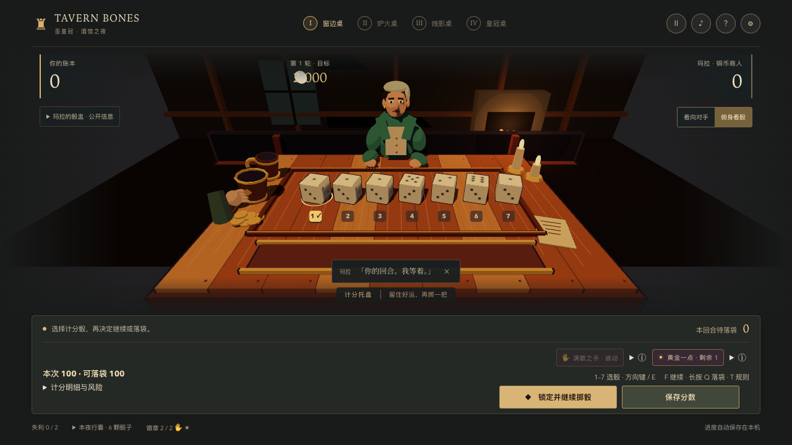
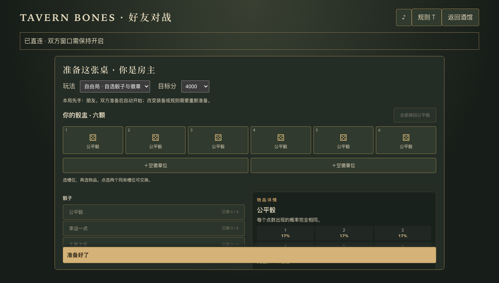
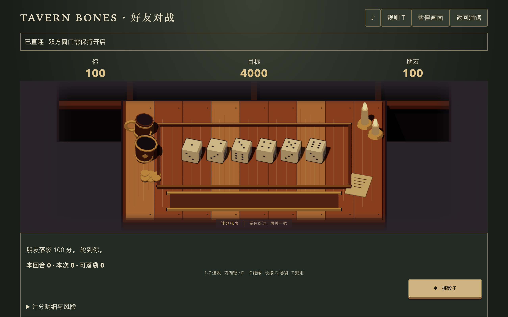

# 界面、键盘与好友直连验收

本次实现保留单机离线玩法和存档，新增共享整备编辑器、局内快捷键及双人私密 WebRTC 对战。最终来源提交由 Mac 清单记录。

## 验证范围

- 单元测试：186 项 / 28 文件通过。覆盖库存替换、交换、核心限制、草稿隔离、七骰规则、双人独立徽章次数、Hot Dice、Bank、完整选择消费、重复命令和过期版本、错误会话、协议版本、输入框/IME 与长按取消。
- `npm run lint`、`npm run build` 通过。构建保留现有 3D 包体大小提示，没有类型或构建错误。
- 浏览器：执行 Chrome、Edge、Firefox 与 WebKit 验收；最终结果见下方完成记录。
- Mac：真实打包应用与 Chrome 使用正式 STUN 配置，手动交换完整邀请/回应后双人落袋；房主最小化期间朋友继续操作，恢复窗口看到最新比分。保留 renderer sandbox=true。
- 单机回归：真实物理 Worker、WebGL/Worker 故障降级、七骰、连续 Hot Dice、Joker 能力、完整四桌冒险、旧存档迁移、暂停演出、关闭恢复、应用替换保留存档。
- 桌面尺寸：1280×720、1920×1080、2560×1080，主要操作可见；自由局整备在 1280×720 显示准备按钮，行囊独立滚动。

双浏览器测试使用两个独立上下文和真实 RTCPeerConnection / RTCDataChannel，在测试内关闭公共 STUN 依赖，强制固定随机结果方便核对比分。覆盖公平局、公开自由配装、双方核心效果、七骰、实际关闭连接后重连、比分不重复、交替先手。Mac 与浏览器互联测试未替换 ICE 配置。

## 边界

测试运行在同一台 Mac，未获得第二个外部网络终端，因此没有完成家庭网络与移动网络、跨运营商 NAT 的实地互联。不能将本地连接通过表述为任意网络可达。首版无 TURN，界面已提供超时、重试与更换网络提示。

WebKit 是 Playwright 引擎测试，不等同发行版 Safari 的人工验收。Mac 使用现有 ad-hoc 签名；没有关闭沙箱、上下文隔离或 Web 安全。没有创建新的 Release 或标签，当前构建通过仓库 LFS 下载，历史 v0.1.0 Release 保留。

## 完成记录

浏览器完整矩阵共 92 项：首轮 88 项通过，Chrome / Edge 各两项旧断言与异步准备等待失败；修正测试后四项定向复验通过。Firefox、WebKit 全套各 23 项通过。另一次并发 WebKit 直连检查曾超过测试等待时限，采用与产品收集信息时限相符的等待后通过。

Mac 完整 8 项通过，包含正式 STUN 配置的 Mac—Chrome 对战。最终包复验时 7 项直接通过，完整四桌用例在与浏览器验收并发运行时出现一次骰子点击超时；停止并发后对同一包单独重跑，40.2 秒通过，未修改游戏逻辑或跳过步骤。最后的 UI 提示和键盘收尾修改已在四种浏览器完成 20 项定向回归，全部通过。归档签名及资源哈希由 `scripts/archive-mac.mjs` 解压核验，记录在 `artifacts/macos/manifest.json`。

来源提交：`9de6ec6ba1423cd2ba1a25802a5f321931e7af1d`。ZIP SHA-256：`1e3d28a0e46049a143e44c72fefe1f3eb90a6273d7c2881049b8fa28477911cf`。

## 界面证据

