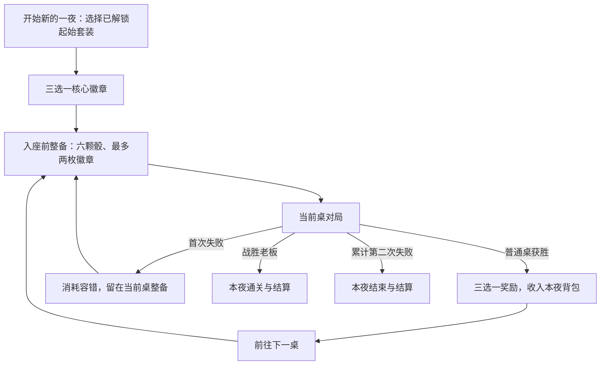

# Tavern Bones：构筑重玩性实施计划

日期：2026-09-12

状态：M0–M4 与 M6 的实现、回归和本机应用交付已完成；M5 已完成原型调参与模拟，个人试玩仍待项目主人体验。实际结果见 [验证记录](validation.md) 与 [构筑验证](build-validation.md)，未完成的体验验收保留未勾选。

本轮目标是让不同骰组与徽章搭配改变玩家的选骰、继续掷骰和落袋决策，并用开局选择、装备保留、同桌重试和完整暂停支撑反复游玩。

## 1. 已确认的产品要求

| 编号 | 要求 | 实施含义 |
| --- | --- | --- |
| R1 | 首要玩家是项目主人自己 | 以愿意反复开局、尝试其他搭配为体验验收标准 |
| R2 | 骰子策略与反复挑战优先 | 新装备应改变决策理由，视听表现服务于理解和操作 |
| R3 | 重玩动力来自骰组与徽章配合 | 先验证少量不同打法，再扩充装备数量 |
| R4 | 强装备可以有明显代价 | 强项、限制和适用局面必须能在界面中解释清楚 |
| R5 | 开局三选一核心装备 | 第一桌就能尝试不同方向，无须先赢一桌才能开始构筑 |
| R6 | 核心占一个现有徽章位，同时最多装备一个核心 | 冒险保持六颗基础骰、最多两枚徽章；核心允许换下并保留 |
| R7 | 保留本夜已经获得的装备 | 桌间和重试前可以重新搭配；一桌开始后装备配置冻结 |
| R8 | 同名特殊骰可以多颗，同名徽章不叠加 | 装备数量受实际持有数量限制；徽章在背包中也算已拥有 |
| R9 | 首败消耗一次容错并重试当前桌 | 首败留在同一桌，允许整备后重赛；累计两败结束当夜 |
| R10 | 离开窗口暂停整个对局 | 停止演出、AI、计时推进和声音，保留已抽出的结果 |
| R11 | 返回后手动点击“继续” | 窗口重新可见或获得焦点不会自动恢复对局 |
| R12 | 不设一夜总时长目标 | 保留投骰和思考空间；快速演出继续作为个人偏好 |

三种首批方向为单骰稳收、同点爆发、顺子与 Joker 补组合。它们的方向已形成共识，具体倍率属于原型参数。

## 2. 当前基线与实施边界

本次审视基于提交 `e5fc3e9` 的项目实现。复核时工作区干净，`npm test` 的 19 个文件、102 项测试通过，`npm run lint` 和 `npm run build` 通过；生产构建仍报告大分包提示。这是实施前基线；本次实施后的浏览器和打包应用结果另记于验证记录。

| 现状 | 对计划的影响 | 主要依据 |
| --- | --- | --- |
| 已有独立计分、状态机、加权骰子、AI 和可取消演出 | 在现有分层上扩展，无须替换技术栈 | [scoring.ts](/Users/yjy/brians/farkle/src/game/scoring.ts)、[state.ts](/Users/yjy/brians/farkle/src/game/state.ts)、[rollPresentation.ts](/Users/yjy/brians/farkle/src/presentation/rollPresentation.ts) |
| 四桌固定路线，普通桌目标 2000，老板桌目标 4000 | 首版保留路线、对手和目标分，先隔离构筑改动的影响 | [adventure.ts](/Users/yjy/brians/farkle/src/game/adventure.ts)、[opponents.ts](/Users/yjy/brians/farkle/src/game/opponents.ts) |
| 全胜一夜只有三次普通奖励，换下装备直接丢弃 | 增加开局核心选择，并分开持有物品与当前装备 | [adventure.ts](/Users/yjy/brians/farkle/src/game/adventure.ts:89) |
| 当前计分搜索先选择基础分最高的拆法，再处理总分加成 | 按组合增减分时，必须调整搜索目标 | [scoring.ts](/Users/yjy/brians/farkle/src/game/scoring.ts:153)、[modifiers.ts](/Users/yjy/brians/farkle/src/game/modifiers.ts:105) |
| 翻倍后使用黄金一点，经典允许、冒险拒绝，但按钮仍可能可点 | 修复规则与交互不一致，并补共同的合法性入口 | [useDiceGame.ts](/Users/yjy/brians/farkle/src/hooks/useDiceGame.ts:511)、[adventure.ts](/Users/yjy/brians/farkle/src/game/adventure.ts:208)、[ActionBar.tsx](/Users/yjy/brians/farkle/src/components/ActionBar.tsx:45) |
| 隐藏窗口会结束投骰等待，AI 仍然推进 | 真正暂停必须覆盖 Hook、演出桥接、场景时钟和原生窗口信号 | [useAdventure.ts](/Users/yjy/brians/farkle/src/hooks/useAdventure.ts)、[visibility.ts](/Users/yjy/brians/farkle/src/platform/visibility.ts) |
| 存档只接受版本 1，且严格验证阶段与装备 | 新版本需显式迁移，不能只添加必填字段 | [adventureStorage.ts](/Users/yjy/brians/farkle/src/storage/adventureStorage.ts) |
| 现有模拟只验证流程，真人平衡性仍待验证 | 自动化和个人试玩分别验收规则与体验 | [validation.md](/Users/yjy/brians/farkle/docs/validation.md:10) |

本轮实现范围约定：新核心、背包、开局选择和失败重试主要进入冒险模式。经典模式保留原有自由配置与独立统计，共享修正后的计分、能力合法性和暂停行为。当前经典允许自由组合已有徽章，不能把冒险的两槽限制直接套入旧经典设置并删掉保存的配置；首版新核心只在冒险入口提供。

继续遵守纯本地运行、原创素材、加权随机、六骰基础配置、Joker 合法替代、禁止跨投掷组合、Hot Dice、Bank 必须包含当前合法选择等规则。第七颗骰仍由满载之手在回合中生成，不能作为背包中的免费装备领取。

本轮交付集中在完整构筑循环。商店、永久数值成长、分支地图、额外角色、联网功能和新的分发平台不列入里程碑。

## 3. 新版玩家循环



暂停是覆盖对局流程的运行状态，不另起一桌、不改变桌号，也不消耗容错。暂停、关闭窗口和恢复都不能提供重新抽取已确定骰子或奖励的机会。

### 3.1 开局核心

首版展示固定的三个候选方向，便于直接比较和反复试验。候选与选择结果写入当夜存档；选中的核心收入背包，并在有空位的开局装备中默认装备。未选中的两件不算已经获得。

已有“商路旧识”“夜行旅人”起始套装和解锁继续生效。起始套装决定六颗基础骰，核心选择决定徽章方向。选择核心不会凭空再赠送一颗配套骰，也不会清除已解锁内容。

玩家必须完成首次核心选择才能入座，之后允许在整备阶段把它换下。核心不是强制永久绑定的职业；后续奖励可以提供尚未持有的其他核心，让中途转型发生在实际获得装备之后。

### 3.2 三种可试玩原型

以下倍率是第一轮验证起点，不代表已验证的平衡结果。名称先使用功能性名称，正式文案在玩法成立后统一为酒馆风格。

| 原型 | 首轮候选收益 | 首轮候选代价 | 需要验证的决策差异 |
| --- | --- | --- | --- |
| 单骰稳收 | 单颗 1、5 的计分组乘 2 | 同点组、顺子组乘 0.5 | 是否更愿意围绕单骰得分、保留可重投骰数，以及选择偏向 1、5 的骰子 |
| 同点爆发 | 三至六同组乘 1.5 | 单骰组、顺子组乘 0.5 | 是否会为了形成高价值同点组合承担更多风险，以及选择集中点数的骰子 |
| 顺子与 Joker | 顺子组乘 2；包含 Joker 的同点组乘 2 | 不含 Joker 的同点组乘 0.5；单骰组保持基础分 | 是否会优先获取 Joker，并在完整组合和即时单骰收入之间产生不同取舍 |

实施调整：歧路罗盘最终使用顺子 ×3、含 Joker 同点 ×2、不含 Joker 同点 ×0.75，单骰不变。上表保留原型起点，调整证据、当前参数和待试玩项目见 [构筑验证](build-validation.md)。

所有加成均作用于本次新投掷中实际选定的合法组合。单颗 Joker 依然不能计分；不新增跨投掷凑组、七同或同点组拆分绕过上限的规则。

首轮使用可以得到整数分数的正倍率，合法组调整后仍大于零。这样装备代价不会悄悄改变“是否有合法计分方式”和 Bust 的定义。

顺子原型的特殊风险必须单独验证：初始六颗公平骰没有 Joker，不能把其早期体验建立在尚未获得的骰子上。先检查自然顺子和现有单骰收入是否足以支撑第一桌；如果第一桌长期只体现惩罚，就调整倍率、触发条件或奖励分布，再验证原型。任何改动都仍通过公开规则和真实加权骰子生效。

普通徽章首轮保留现有能力，以便分辨核心带来的影响。将“无核心、护符加满载之手”纳入同一可达背包条件下的对照，检查它是否使三种核心都失去选择价值。不得仅靠强制装备核心掩盖这个问题。

### 3.3 背包与整备

背包记录本夜总持有量，包含正在装备的部分。界面分别显示“持有”“已装备”“可用”，不把三个数字当成三个独立库存。

| 操作 | 规则 |
| --- | --- |
| 起始骰组入包 | 按起始套装的实际六颗骰子登记数量 |
| 获得同名特殊骰 | 持有数量增加一颗，可在不同骰位装备 |
| 换下骰子 | 保留在本夜背包，六个基础骰位仍需全部配置 |
| 获得徽章 | 每种徽章本夜最多持有一枚，核心也适用 |
| 换下核心 | 保留在背包；之后可换回；同时最多装备一个核心 |
| 两徽章槽已满 | 仍可收下新徽章，留待整备时决定替换 |
| 对局进行中打开行囊 | 可查看持有和装备，禁止修改本桌配置 |
| 新的一夜 | 重新生成本夜背包；收藏、外观与起始套装解锁继续保留 |

整备使用草稿，点击“确认装备并入座”时同时校验数量、槽位和核心上限，再生成本桌配置快照。不能通过连续点击、重复物品条目或拖放把一颗骰子装备多次。

### 3.4 奖励

普通桌获胜后仍提供三个不同选项，玩家选择一件或主动放弃。本次选择收入背包，然后进入下一桌整备；领取不要求立即替换现有装备。

徽章候选排除本夜所有已拥有徽章，不能仅排除正在装备的徽章。特殊骰允许重复获得。候选池加入尚未持有的其他核心，支持后续转型；界面显示其效果、代价及核心占位规则。

初版保留可复现的随机三选一机制。是否调整不同奖励的权重，由原型结果决定；不承诺每桌必出最适配装备。奖励继续使用独立随机流，与掷骰随机流分开。

每次奖励提供稳定的领取标识，生成后立即保存。重复点击、刷新、过期回调和重入页面都不能重复发放或更换这次候选。

### 3.5 同桌重试

| 结算条件 | 结果 |
| --- | --- |
| 普通桌获胜 | 记录本次胜利，生成一次奖励，领取或放弃后前往下一桌 |
| 任意桌首次失败 | 失利数变为 1，记录本次失败，留在当前桌的整备阶段 |
| 重试入座 | 双方比分归零，回合状态重建，使用重新确认的装备 |
| 再次失败 | 失利数变为 2，结束当夜，不提供第三次尝试 |
| 重试获胜 | 正常前进；普通桌发放一次胜利奖励，老板桌通关 |

重试保留本夜背包、最大落袋、最大爆骰损失和所有对局历史。每回合技能和“每局一次”技能按新的一桌对局重新初始化；这里的“局”是一场桌面对局，不是整夜。

重试沿用当前随机流并继续向前抽样，不重置到上次对局开头。已经结算的失败不会被刷新撤销，也不会通过重试发放失败奖励。

历史记录应能区分同一桌的第一次对局与重试。新夜最多五场对局，结算中的桌数、场次和胜负不要混用。

## 4. 计分与能力的共同契约

### 4.1 在 DFS 中比较装备后的收益

保留合法组合枚举和位掩码 DFS。新增按计分组处理收益的纯 Modifier 回调，输入应包含组合种类、基础分、骰子索引、Joker 替代以及当前行动方的冻结评分上下文。

处理顺序为：

1. 按原规则枚举合法组合。
2. 为每个候选组合计算装备生效后的分数及明细。
3. DFS 在相同的完整消费、不得重用骰子和同点组限制下，最大化调整后总分。
4. 对已经选择出的合法拆分处理统一总分效果。
5. “孤注一掷”只翻倍当前合法选择；落袋时再加上此前临时分。

例：在单骰稳收原型下，选择 `[1, 1, 1]` 时，三个单骰分别为 200，总计 600；三同 1 为 `1000 × 0.5 = 500`。搜索应返回三个单骰。先取基础分最高的三同，再事后修改总分，会漏掉更高的合法结果。

明细中的“基础分”必须来自最终采用的那组拆分，不能拿另一种基础最优拆分的分数做减法。上例应显示三个“100 → 200”，而不是把 1000 当成所选拆法的基础分。

首批核心是可逐组相加的效果，一次搜索中评分上下文固定。当前局部 memo 可以继续按已使用骰掩码与已使用同点面值缓存；如增加跨调用缓存，需要包含规则版本、行动方和装备上下文。以后若引入依赖组合使用次数的效果，再扩展搜索状态。

### 4.2 共享一次评分结果

建立共同的选择评估入口，返回是否合法、基础分、装备调整、最终分、分组、未消费骰子和非法原因。经典 Hook、冒险 reducer、计分明细、按钮状态、锁定和 Bank 都消费同一契约。

`ScoreExplanation` 不再自己重复组合一套基础计分与加成公式。减益应显示为明确的负调整，避免现有“+{bonus}”产生“+-分数”的文案。

AI 继续先取当前投掷的最高合法分，再根据原有风险策略决定继续或落袋。共享评分入口必须接收正确行动方的装备；本轮不向现有对手额外添加核心，也不能误把玩家装备用于 AI。

### 4.3 保住基础规则

必须覆盖完整消费、禁止跨投掷组合、Joker 只参与组合、三至六同上限、第七骰的合法单骰余量、Hot Dice 重获完整骰组、Bust 清空整回合临时分，以及 Bank 包含当前投掷合法选择。

首版核心不改变骰子权重和合法组合集合，因此原始爆骰概率继续按实际剩余骰组计算，不因“装备提升得分”而改写风险缓存。护符的保护次数独立说明。

### 4.4 统一主动能力

按现有“孤注一掷确认后锁定选择”的含义统一两种模式：翻倍后冻结本次选择和骰值，黄金一点须在翻倍前使用。能力合法性由共同纯函数判断，界面只呈现结果。

黄金一点、孤注一掷、骰子切换、锁定和落袋都应给出一致的可操作状态及原因。翻倍后的黄金一点按钮禁用并说明原因，不能保留可点但无反馈的行为。

黄金一点的目标可以是本次新骰中尚不能单独计分的点数；在本次投掷已进入可选择阶段的前提下，只要求选中一颗合法目标骰。不能为了共用校验而要求变点前的选择已经可以计分，否则会缩窄现有能力。

这项修复属于操作语义一致性；先黄金一点再翻倍本来就能得到对应分数，不把旧行为描述为得分漏洞。

## 5. 数据结构与存档迁移

### 5.1 字段职责

建议采用版本 2 的持久化外层，将纯冒险状态与运行时暂停检查点分开。下面定义职责，具体 TypeScript 命名可以随实现调整。

| 数据 | 职责与约束 |
| --- | --- |
| 存档版本 | 新外层 `version: 2`，读取器显式识别版本 |
| 现有冒险状态 | 保留 id、revision、两条随机状态、桌号、失利、阶段、对局、待演出骰子、奖励和历史 |
| `inventory.dice` | 骰子定义 ID 到持有数量的映射；数量为有界正整数，包含已装备部分 |
| `inventory.modifiers` | 持有徽章 ID 的唯一集合，包含核心与已装备徽章 |
| `loadout` / `modifiers` | 保持当前整夜装备选择的职责，与库存分开校验 |
| 开局选择记录 | 候选核心、选择结果、是否完成；旧存档迁移可明确标记为跳过开局选择 |
| 奖励标识 | 将领取动作绑定当前这次候选，防止旧事件误领下一次奖励 |
| 规则版本 | 固定本夜使用的评分参数版本；平衡更新不重新计算正在进行的对局 |
| 暂停检查点 | 是否等待手动继续、当前待执行步骤及必要的剩余演出时间；不存 DOM、Promise 或 AudioContext |

同名骰目前没有独立升级、耐久或词缀，用数量记录足够。投掷中的 `DieInstance.id` 继续标识本次骰子，不把它当作永久物品身份。

暂停检查点与 gameplay revision 分开管理，防止仅仅暂停就把同一次待完成投掷误判为过期任务。暂停期间允许保存暂停元数据，骰子、比分、装备使用次数、随机状态和冒险进度保持不变。

### 5.2 状态转换边界

新增开局选择阶段，整备继续沿用 `seat` 的职责。奖励领取负责增加持有量，整备确认负责改变装备，入座负责生成深拷贝的本桌配置。

所有数量变动通过纯 reducer 一次性更新。不能先改库存、后改装备并分别保存；保存失败时当前内存状态仍保持一致，继续使用已有存储警告提示。

在 `playing` 阶段，`game.config` 是权威快照。奖励或整备阶段中，整夜装备与刚结束那桌的 `game.config` 不同是正常状态，存档验证不能因此拒绝恢复。

### 5.3 版本迁移流程

使用新的 `tavern-bones-adventure-v2` 作为新版读写键，保留旧 `tavern-bones-adventure-v1` 作为迁移来源。设置、经典统计、音效、收藏和体验偏好原有键继续使用。

| 读取情况 | 行为 |
| --- | --- |
| 存在有效 v2 | 读取 v2，不重新导入 v1 |
| 存在损坏或不支持的 v2 | 保留原数据并提示无法恢复，不自动回退到旧夜制造进度倒退 |
| 没有 v2，但有有效 v1 | 迁移到 v2，写入成功后以 v2 为后续来源，保留 v1 原文 |
| 迁移后写入失败 | 当前内存中可继续，显示保存失败；不破坏原 v1 |
| 两者都没有 | 正常开始新版新夜 |

迁移必须保留当前桌、已完成历史、失利次数、待演出骰值、选择状态、两条随机状态和已生成奖励。背包只能收录旧存档仍记录的六颗装备骰与装备徽章，不能虚构此前已经丢弃的物品。

旧夜跳过新开局核心选择，下一夜启用开局三选一。已发生的旧版失败跳桌历史保持原样，不撤销胜负或倒退桌号；迁移后新发生的首次失利按同桌重试处理。已经有一次失利的旧夜不会额外获得一条容错。

迁移后的进行中对局首次打开时等待手动“继续”，不能在玩家检查页面前自动完成待演出结果。已有起始套装解锁、收藏、结算去重记录和 Mac 独立存储位置继续保留。

v1 备份不是自动同步副本；计划不把含核心和背包的 v2 反向写回旧格式。旧程序回滚读取的仍是升级时保存的旧状态。

### 5.4 序列化验收

覆盖开局未选、入座前、玩家投掷待演出、已选骰、AI 各阶段、护符已消耗待重投、奖励待领、首次失败待重试、暂停、胜利与第二次失败等状态。

每种状态执行“序列化 → 读取 → 继续动作”，结果需与不中断流程一致；允许重新建立视觉对象，不允许重新抽取既定结果或重复发放物品。

## 6. 真正暂停与手动恢复

### 6.1 统一会话控制

建立一个共享、可取消的对局运行控制器，为两个 Hook、演出桥接和场景提供暂停状态、仅在运行时流逝的时间，以及等待恢复的入口。浏览器事件留在平台层，纯游戏逻辑不访问 DOM。

需要暂停的事件包括页面隐藏、窗口失去焦点、Mac 隐藏或最小化。规则、设置等遮挡进行中对局的面板也按同一暂停机制处理。大厅和未开始的设置界面不会额外进入一个需要恢复的对局。

窗口可见、重新获得焦点或关闭面板只解除环境阻挡；保持“等待继续”。用户点击“继续”且没有其他阻挡后，才恢复计时、演出和 AI。

Mac 当前仅发布可见性通知，需要补充可靠的窗口活动/焦点信号。预加载接口仍只暴露只读生命周期信息，不扩展为任意 IPC 或文件系统接口。

### 6.2 必须冻结的对象

| 对象 | 暂停行为 | 恢复要求 |
| --- | --- | --- |
| 玩家和 AI 投掷 | 保留本次已抽骰子与请求身份 | 完成同一投掷，不再次调用加权抽样 |
| AI 查看、选择和决策延迟 | 冻结剩余等待 | 从同一步继续，不能同时启动两个 AI 循环 |
| 护符重投 | 保留是否已消耗及是否已经抽取后续结果 | 已消耗次数不回退；已抽结果不重抽 |
| Hot Dice、回合交接、Bust 停顿 | 冻结待执行任务 | 恢复后只执行一次 |
| 3D 骰子、骰盅和角色动作 | 冻结播放进度和当前姿态 | 使用运行时间，不因后台停留而跳到末帧 |
| 漫画反馈和 CSS 动画 | 暂停动画时间 | 保留事件身份，避免重新触发一遍提示 |
| 音效与环境调度 | 停止声音和调度 | 手动继续时按偏好恢复，不补播后台错过的声音 |
| 演出超时保护 | 暂停超时预算 | 只计算前台运行时间 |
| 点击、键盘和技能动作 | 阻止对局动作 | “继续”、返回大厅等明确的控制动作仍可用 |

物理 Worker 可以完成已经开始的预计算并缓存轨迹，但它不能因此揭晓骰面、播放碰撞声或提交对局结果。

### 6.3 修正全部“隐藏即结束”路径

需要同时处理以下入口，不能只暂停 Hook 的某一个定时器：

- `useDiceGame` 的 `wait()`、AI 循环、玩家投掷、护符、Hot Dice 和落袋后交接定时器。
- `useAdventure` 的 `ROLL_FINISHED`、`TICK` 以及 6000 ms 演出保护。
- `RollPresentation` 的降级计时、就绪状态改变和完成回调。
- `TavernScene` 隐藏时直接 `presentation.finish()` 的路径，以及使用墙钟计算帧位置的代码。
- `ThrowCup`、角色动作、音效可见性监听与漫画动画。

暂停不等于取消。新游戏、返回大厅和卸载继续通过 `runId`、revision 与 `AbortSignal` 取消旧任务；取消完成不得被当作一次正常掷骰完成。

暂停时发生 WebGL 丢失、Worker 失败或演出加载失败，可以记录需要降级，但结果提交仍须等待用户继续。2D 降级同样遵守暂停。

### 6.4 进程内与重启后的恢复

同一进程内暂停时保留剩余延迟、轨迹进度和已播放的碰撞事件位置。真正关闭页面或应用后，继续保留对局阶段、骰子结果和随机状态；点击继续后可以重建并重新播放该次演出，不要求把物理帧缓存写入存档。

重建演出不能再扣一次能力、再抽一次骰子、增加第二次投掷次数或重新选择 AI 得分。经典模式保持现有关闭后不恢复进行中对局的边界，进程内暂停仍完整生效。

## 7. 界面与信息表达

| 页面或组件 | 变化 | 验收重点 |
| --- | --- | --- |
| 酒馆大厅 | 保留起始套装选择；新夜进入核心三选一；移除未验证的固定时长承诺 | 继续旧夜不会触发新开局奖励 |
| 核心选择 | 三张卡显示强项、代价和计分例子 | 看卡片即可理解一项收益和一项牺牲 |
| 入座前整备 | 六个骰位、两个徽章位、本夜背包与可用数量 | 不依赖拖放，能通过按钮与键盘完成换装 |
| 奖励选择 | 收入背包，下一桌再整备；保留主动放弃入口 | 两槽已满也能领取；领取一次后不能重复获得 |
| 首败界面 | 显示本桌失败、剩余容错和整备入口 | 不暗示已前进，不把重试当作新夜 |
| 计分明细 | 展示所选拆分的基础分、核心收益/代价、翻倍和总分 | 数字与锁定、Bank 一致；负调整文案正确 |
| 暂停对话框 | 明确“对局已暂停”和“继续”按钮 | 焦点可达，背景不可操作；窗口返回不自动消失 |
| 行囊与结算 | 区分当前装备、未装备持有物和对局场次 | 同桌重试有独立胜负记录，收藏只结算一次 |

沿用深色木桌、羊皮纸、铜色强调和原创场景。新界面使用已有按钮、对话框与焦点规范，保持 `aria-label`、`aria-live`、减少动态效果及 2D 降级支持。

玩家只需看到可用数量、装备限制、分数与结果。物品标识、随机种子、revision、迁移字段和调试统计留在实现与验证材料中。

## 8. 主要文件落点

下列新增文件名为建议，实际拆分以保持职责清楚为准；不把所有新增规则继续堆进两个 Hook。

| 职责 | 现有文件 | 建议新增 |
| --- | --- | --- |
| 核心定义与评分上下文 | [types.ts](/Users/yjy/brians/farkle/src/game/types.ts)、[modifiers.ts](/Users/yjy/brians/farkle/src/game/modifiers.ts)、[scoring.ts](/Users/yjy/brians/farkle/src/game/scoring.ts) | `/Users/yjy/brians/farkle/src/game/cores.ts`、`/Users/yjy/brians/farkle/src/game/selection.ts` |
| 背包与装备校验 | [adventure.ts](/Users/yjy/brians/farkle/src/game/adventure.ts)、[rules.ts](/Users/yjy/brians/farkle/src/game/rules.ts) | `/Users/yjy/brians/farkle/src/game/inventory.ts` |
| 存档与兼容 | [adventureStorage.ts](/Users/yjy/brians/farkle/src/storage/adventureStorage.ts)、[gameStorage.ts](/Users/yjy/brians/farkle/src/storage/gameStorage.ts)、[App.tsx](/Users/yjy/brians/farkle/src/App.tsx) | `/Users/yjy/brians/farkle/src/storage/adventureStorage.test.ts` |
| 两种模式编排 | [useAdventure.ts](/Users/yjy/brians/farkle/src/hooks/useAdventure.ts)、[useDiceGame.ts](/Users/yjy/brians/farkle/src/hooks/useDiceGame.ts)、[state.ts](/Users/yjy/brians/farkle/src/game/state.ts) | 共同能力/选择入口放入纯逻辑层 |
| 运行与暂停 | [visibility.ts](/Users/yjy/brians/farkle/src/platform/visibility.ts)、[rollPresentation.ts](/Users/yjy/brians/farkle/src/presentation/rollPresentation.ts) | `/Users/yjy/brians/farkle/src/presentation/GamePlayback.ts` 及对应测试 |
| 3D 与音效 | [TavernScene.tsx](/Users/yjy/brians/farkle/src/scene/TavernScene.tsx)、[ThrowCup.tsx](/Users/yjy/brians/farkle/src/scene/ThrowCup.tsx)、[TavernCharacter.tsx](/Users/yjy/brians/farkle/src/scene/TavernCharacter.tsx)、[gameAudio.ts](/Users/yjy/brians/farkle/src/audio/gameAudio.ts) | 复用共享运行时间，避免每处各自维护暂停计时 |
| 玩家界面 | [AdventureGame.tsx](/Users/yjy/brians/farkle/src/components/AdventureGame.tsx)、[TavernLobby.tsx](/Users/yjy/brians/farkle/src/components/TavernLobby.tsx)、[ActionBar.tsx](/Users/yjy/brians/farkle/src/components/ActionBar.tsx)、[ScoreExplanation.tsx](/Users/yjy/brians/farkle/src/components/ScoreExplanation.tsx) | `/Users/yjy/brians/farkle/src/components/CoreChoice.tsx`、`/Users/yjy/brians/farkle/src/components/LoadoutPanel.tsx`、`/Users/yjy/brians/farkle/src/components/PauseDialog.tsx` |
| Mac 生命周期 | [main.cjs](/Users/yjy/brians/farkle/desktop/main.cjs)、[preload.cjs](/Users/yjy/brians/farkle/desktop/preload.cjs) | 保持只读接口，扩充窗口焦点信号 |
| 验证与说明 | [e2e/adventure.pw.ts](/Users/yjy/brians/farkle/e2e/adventure.pw.ts)、[game.desktop.ts](/Users/yjy/brians/farkle/e2e-desktop/game.desktop.ts)、[README.md](/Users/yjy/brians/farkle/README.md)、[validation.md](/Users/yjy/brians/farkle/docs/validation.md) | `/Users/yjy/brians/farkle/scripts/simulate-builds.ts`、必要的固定存档样例 |

## 9. 七个实施里程碑

默认按以下顺序推进。每一阶段完成对应验证后再合入下一阶段；工期以实际实现和试玩问题为准，不预先压缩演出或设定整夜时长。

| 阶段 | 主要产物 | 前置条件 | 完成标准 |
| --- | --- | --- | --- |
| M0 规则契约与基线 | 需求映射、核心参数表、关键对局/存档样例 | 本计划 | 每项变更有明确旧行为、新行为与预期结果 |
| M1 计分与能力一致性 | 装备感知 DFS、共同选择评估、能力禁用原因 | M0 | 新旧规则反例通过，两模式预览与结算一致 |
| M2 背包与存档 | 持有/装备分离、v2 读写与 v1 迁移 | M1 的类型契约 | 数量不增殖，关键阶段恢复一致 |
| M3 新冒险循环 | 开局核心、奖励入包、整备、同桌重试和界面 | M1、M2 | 从开局到结算可完整游玩三种核心 |
| M4 完整暂停 | 共享运行控制、手动继续、浏览器与 Mac 生命周期 | M0；集成时使用 M2、M3 | 所有阶段后台不推进，恢复与取消各只执行一次 |
| M5 构筑试玩与调校 | 仿真记录、个人试玩记录、修订参数 | M3、M4 | 三方向有实际选择价值，无已知普遍支配配置 |
| M6 回归与交付 | 全部检查、真实应用验证、文档与更新后的本机应用 | M5 | 验证记录准确，旧存档与新夜都能完成 |

### M0：把约束变成可验证样例

- [x] 记录实施前实际测试结果与基线提交，保留用户无关改动。
- [x] 固定三套核心的原型参数、字段和效果顺序。
- [x] 准备三同拆成单骰、Joker 多种替代、同点上限、跨投掷错误等手工反例。
- [x] 准备旧存档在投掷、AI、奖励、已跳桌和结算阶段的样例。
- [x] 将 R1–R12 分配到对应自动化或试玩验收项。

### M1：先把分数算对并解释一致

- [x] 为 Modifier 增加按组评分能力与核心分类，计分器不硬编码核心名称。
- [x] 改造 DFS 的候选收益，保留既有合法性约束和稳定的同分选择规则。
- [x] 建立共同选择评估、计分明细和能力合法性入口。
- [x] 接入两种模式、AI 行动方上下文、按钮和 Bank。
- [x] 修复翻倍后黄金一点差异；新增负调整文案。
- [x] 对无核心配置验证原有分数、随机抽样和状态转换不变。

### M2：建立物品归属与可靠恢复

- [x] 增加持有量、装备校验和纯换装操作。
- [x] 定义 v2 外层、开局选择记录、奖励标识和暂停检查点。
- [x] 实现 v1 到 v2 迁移及明确的读取优先级。
- [x] 保留未结束对局的配置、已抽结果、随机流和结算去重信息。
- [x] 添加数量、槽位、核心上限、未知字段/ID 和阶段一致性验证。
- [x] 验证写入失败与重复恢复，不虚构遗失装备或重发奖励。

### M3：让完整构筑循环可玩

- [x] 新夜增加核心三选一，已有起始套装继续有效。
- [x] 奖励收入背包，按持有集合过滤徽章候选。
- [x] 实现整备草稿、数量反馈、核心替换和确认入座。
- [x] 统一普通桌与老板桌首次失败的同桌重试流程。
- [x] 为同桌多次对局补充历史表达，保持五场上限与幂等结算。
- [x] 完成核心卡片、整备、奖励、首败与结算界面，并覆盖键盘操作。
- [x] 从可见按钮完成一夜，包含至少一次换装和一次重试。

### M4：暂停冻结所有推进来源

- [x] 建立共享运行时间、可暂停等待和恢复门禁。
- [x] 替换两个 Hook 内的非暂停定时任务；保留取消保护。
- [x] 调整演出桥接、超时、WebGL 降级及 2D 完成回调。
- [x] 用运行时间驱动轨迹、骰盅、角色与漫画反馈。
- [x] 接入浏览器焦点/可见性和 Mac 生命周期，手动继续统一生效。
- [x] 接入暂停对话框、焦点恢复、音效和环境调度。
- [x] 分别验证“暂停后继续”“暂停后新局”“暂停后退出并恢复”。

### M5：验证装备确实改变打法

- [x] 建立固定种子的纯逻辑模拟脚本和可复现参数记录。
- [x] 对三核心、不同起始套装和可达背包配置进行比较。
- [x] 单独检查护符加满载、Joker 多骰及翻倍等组合是否压过所有核心选择。
- [ ] 进行个人试玩，记录选骰、落袋、奖励和换装理由。
- [x] 对弱原型调整有限参数，再复验受影响规则与玩法。
- [x] 保持现有奖励数量与能力范围，待三方向个人试玩成立后再扩充。

### M6：完成回归和本机交付

- [x] 依次通过单元/组件测试、lint 和生产构建。
- [x] 浏览器中验证新夜、旧存档、故障降级、暂停和完整键盘流程。
- [x] 在实际打包 Mac 应用中验证离线运行、失焦/最小化、退出恢复和完整一夜。
- [x] 更新 README、规则、装备描述、时长文案与验证记录。
- [x] 检查 Git 差异，不纳入构建产物、日志、测试存档或用户无关改动。

## 10. 测试矩阵与执行方式

测试应验证规则、边界和真实流程，不用只复刻实现细节的断言代替行为检查。

| 需求覆盖 | 主要阶段 | 验收入口 |
| --- | --- | --- |
| R1–R4：个人重玩、策略与有代价构筑 | M1、M3、M5 | 核心反例、可达装备对照、个人选择理由记录 |
| R5：开局三选一 | M2、M3 | 新夜流程、选中核心只发一次、刷新恢复 |
| R6–R8：槽位、背包与数量 | M2、M3 | 库存校验、桌间换装、对局快照与键盘整备 |
| R9：同桌重试 | M2、M3 | 四张桌的首败/二败、重试胜利、旧历史迁移 |
| R10–R11：完整暂停与手动继续 | M4、M6 | 全阶段假时钟、浏览器/原生失焦、超时与取消竞态 |
| R12：手感优先、无总时长目标 | M3、M5、M6 | 演出和思考体验、偏好保留、时长文案更新 |

| 层次 | 必测情况 | 结果要求 |
| --- | --- | --- |
| 基础计分 | 单骰、多单骰、三至六同、两种五骰顺子、六骰大顺、多个组合 | 无核心时与现有正式规则一致 |
| 装备搜索 | 三个 1 在单骰核心下改用三个单骰；含 Joker 的不同拆法；同分情况 | 返回装备生效后的最高合法结果 |
| 合法性 | 非法混选、未完整消费、单 Joker、七骰上限、跨投掷凑组 | 加成不能使非法选择合法 |
| 回合 | 多轮临时分、Hot Dice、Bust、当前选择必须纳入 Bank | 所有合法路径的预览、锁定、Bank 一致 |
| 能力 | 黄金一点后翻倍、翻倍后尝试改点/改选、护符重投 | 两种模式一致，次数只消耗一次 |
| AI | 同一评分入口、正确行动方、加权骰子、风险阈值差异 | 不使用玩家装备，不因表现层重新抽样 |
| 背包 | 重复骰、唯一徽章、核心换出换回、库存不足、两个核心、两槽已满领奖 | 持有量正确，不能复制装备 |
| 装备快照 | 桌间变动、对局中修改尝试、奖励后尚未入座 | 只有入座才改变本桌配置 |
| 重试 | 每张桌首败、首败后胜利、首败后再败、刷新 | 同桌重试、累计两败结束、奖励不重复 |
| 迁移 | v1 所有关键阶段、v2 损坏、写入失败、重复加载 | 结果和随机流保持一致，不自动退回旧进度 |
| 暂停 | 玩家滚动、AI 各步、护符、Hot Dice、Bust、交接、刚好结束的竞态 | 超过原超时时间也不推进，点击继续后只完成一次 |
| 取消 | 暂停时新游戏、返回大厅、卸载、旧 Worker 晚回 | 旧任务不污染新局 |
| 降级 | Worker 失败、WebGL 不可用/丢失、3D 加载失败、减少动态效果 | 保留同一结果及暂停语义，规则可继续 |
| 可访问性 | 从大厅 Tab 导航至核心、整备、选骰、落袋、暂停恢复和奖励 | 可用键盘完成完整路径，焦点和提示明确 |
| Mac | 离线、失焦、隐藏、最小化、关闭/Dock 重开、移动替换应用 | 对局不后台推进，存档位置和只读安全边界保持 |

现有测试中，隐藏后结束投骰或允许 AI 在后台获胜的断言必须按新产品行为改写，尤其是 [useDiceGame.presentation.test.tsx](/Users/yjy/brians/farkle/src/hooks/useDiceGame.presentation.test.tsx:98) 和该文件第 123 行开始的场景。保留原先验证后台静音的覆盖，同时新增不推进状态的断言。

完整一夜辅助脚本也必须升级：它目前按基础分选骰并按旧规则直接替换装备。新版应通过可见界面完成核心选择、奖励入包、整备和手动继续，并使用正确的装备评分上下文。对应入口是 [completeNight.ts](/Users/yjy/brians/farkle/e2e/helpers/completeNight.ts)。

暂停断言比较的是对局关键快照：桌号、流程、比分、骰值、选择、能力使用次数、两条随机状态和待执行身份。暂停元数据的保存不算对局推进。仿真时钟推进至少覆盖原 6 秒超时，并检查恢复后不会在同一时刻补执行整串任务。

每个涉及规则、状态机、组件接口或配置的提交前，按仓库要求依次执行：

```bash
npm test
npm run lint
npm run build
```

UI 与运行流程接入后执行有针对性的浏览器场景；最终再执行完整浏览器与打包应用套件：

```bash
npm run test:browser -- --project=chrome
npm run test:browser
npm run test:desktop
```

测试引擎按 README 的现有准备步骤安装。浏览器和 Mac 使用隔离测试存档，不读取或覆盖实际玩家的当夜存档。通过后的重复测试由新改动、失败或未解决的问题驱动。

## 11. 构筑与手感验收

### 11.1 自动化比较

执行记录：原型每行使用 60 个种子筛查；最终每行使用 120 个种子，并增加 120 个独立种子和保守策略对照。以下保留原计划的验证口径。

首轮每种核心使用相同的 100 个固定种子、相同起始套装和对手规则运行。记录核心参数版本、骰组、徽章、种子、选骰/继续策略和结算结果。若出现明显弱势、近似相同策略或普遍支配配置，再针对相关条件扩大样本。

比较通关率、各桌失败分布、落袋收益、爆骰损失、不同计分组占比、选择的骰数、继续/落袋比例、奖励选择和换装情况。记录实际耗时用于发现冗长等待，不以统一时长作为淘汰条件。

相同种子不保证不同策略逐手遇到完全相同结果：不同选骰会消耗不同数量的随机数。报告要保留轨迹并说明比较条件，不为了对齐结果修改加权抽样。

模拟玩家不能只用一个固定贪心策略就宣布某流派无效。至少配合几个明确的保守、常规、冒险阈值，并检查手工构造的有利局面；模拟结果用于发现问题，不能证明最优策略或真人平衡。

### 11.2 个人试玩

每种核心先至少完成两夜，组合覆盖首败重试、核心换出换回，以及获得另一个核心后的转型。必要的边界可用固定存档快速进入，无须等待自然随机触发所有情况。

每夜记录四件事：一次因核心而改变的选骰或落袋决定、一次奖励取舍、一次感到收益或代价的时刻，以及是否愿意用另一套搭配再开一夜。

### 11.3 通过标准

- 每个核心至少有可重复演示的有利局面和需要承担的代价。
- 在实际试玩中，装备变化能改变选骰、继续/落袋或奖励选择的理由。
- 顺子/Joker 方向在尚未获得 Joker 的第一桌也有可玩的基础。
- 相同可达背包下，没有已知配置在所有已测场景中都使其他搭配失去价值。
- 首败后能利用已获得装备重新考虑打法；第一桌没有额外装备时也能清楚理解重赛规则。
- 暂停后回来能够看清接下来发生的动作，投骰和 AI 不跳过需要观察的过程。
- 三类配置都能通过合法流程完成整夜；自动化通过与个人试玩结论分别记录。

若换装后始终选择相同骰子、相同奖励并在相同条件落袋，仅总分变大，就需要继续调整核心。优先修正现有三套原型，避免靠增加大量装备掩盖差异不足。

## 12. 关键风险与交付清单

| 已知风险 | 实施中的处理 |
| --- | --- |
| 按组加成使基础最优拆分失效 | 用装备后的候选收益搜索，并保留手工反例 |
| 两个 Hook 再次出现能力语义差异 | 共享纯判断与评分，分别测试可见操作路径 |
| 背包与装备数量互相漂移 | 明确持有量包含已装备；所有变动原子提交 |
| 旧存档被新字段或新阶段拒绝 | 独立版本迁移、关键阶段样例、显式读取优先级 |
| 暂停只覆盖一层，其他回调仍完成对局 | 统一运行时间与提交门禁，覆盖 Hook、演出、场景和原生信号 |
| 暂停与取消混淆导致死锁或重复提交 | 分开生命周期，保留请求身份、取消保护与竞态测试 |
| 核心强度差异被误当成策略深度 | 记录行为与选择理由，纳入无核心双普通徽章对照 |
| 新核心扩散到经典设置并改变旧配置 | 按模式控制可选装备入口，保留旧经典设置结构与自由组合 |

最终交付应包括：三套可试玩核心、开局选择、本夜背包与整备、同桌重试、完整暂停与手动继续、统一计分明细和能力行为、v2 存档及 v1 迁移、对应自动化测试、可复现的模拟脚本、试玩记录、更新后的使用说明和实际验证记录。

计划完成的判据是这些功能已经共同组成可玩的整夜流程，规则与兼容性检查通过，并且个人试玩确认不同搭配有继续尝试的价值。完成一个新面板、增加三条装备定义或获得一组通过的测试，均不足以单独代表本轮完成。
